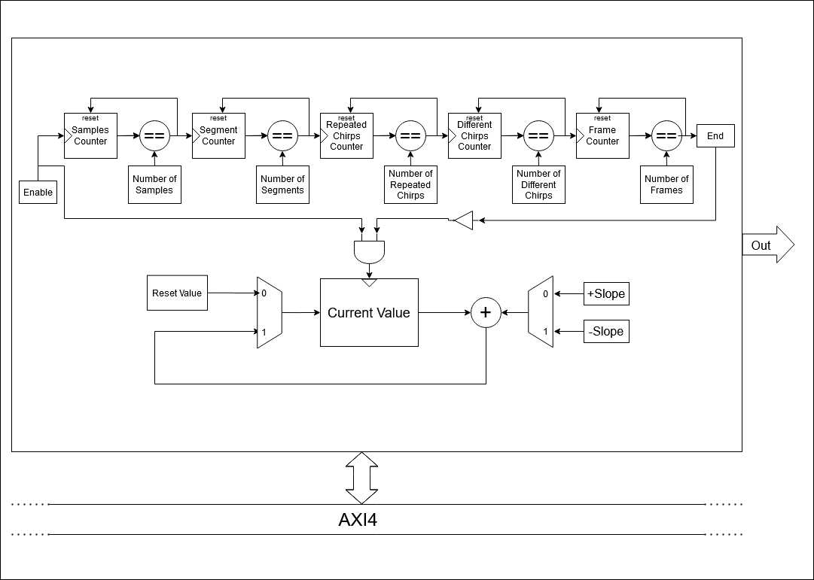
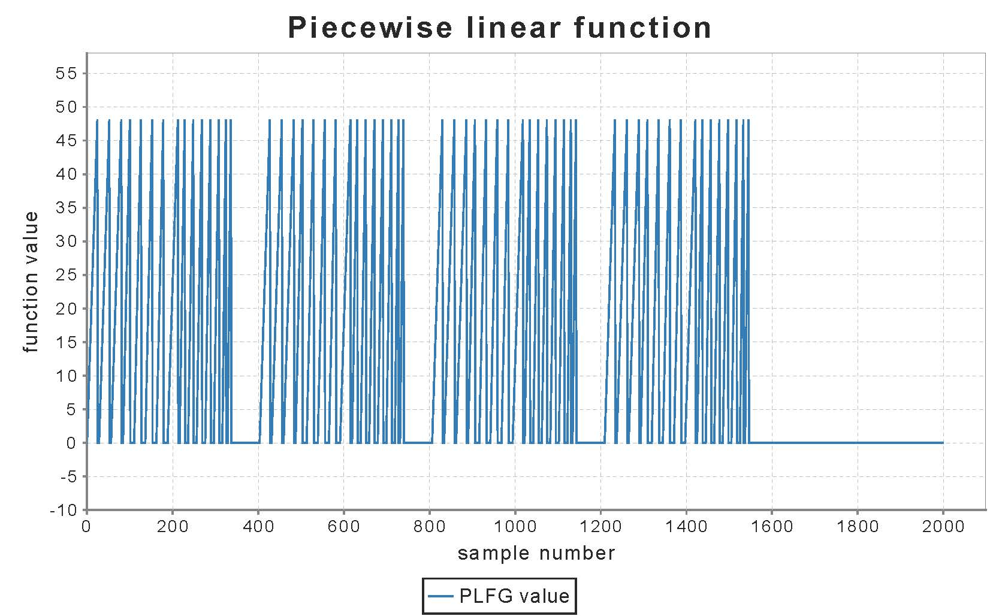

Piecewise Linear Function Generator (PLFG) Chisel Generator
========================================================

## Overview
This repository contains a generator of a parametrizable piecewise linear function waveform generator with various options regarding output signals, written in [Chisel](http://www.chisel-lang.org) hardware design language.
Piecewise linear function generator can be used in various digital systems, e.g. for sourcing NCO in order to generate
chirp signals used in FMCW radar systems.

To make a Chisel project and include PLFG generator, an open source starter template [Chipyard Framework](http://github.com/ucb-bar/chipyard) can be used.

### Piecewise Linear Function Generators
A Piecewise Linear Function Generator produces output signal consisting of one or multiple linear segments. Every segment has its own
slope value, sign of the slope (positive/negative) and length/number of samples (must be greater than one). Segments can also be configured to have the reset value as the output signal value.
Output signal has defined hierarchy: array of consecutive output samples is called a segment. Consecutive segments make a chirp 
(named after chirp signals used in radar systems) and consecutive chirps make a frame. Every chirp used in a program must be defined 
before the start of the program. Defining a chirp includes defining a number of segments used in a chirp and setting up slope, slope sign and segment length values 
for every segment in a chirp. After defining all the chirps needed by the program, they can be used to determine output signal values during the program. 
Every chirp can appear multiple number of times (or not appear at all) in any given order. 

The generated module consists of several counters with a function to indicate if segment/chirp/frame/program has come to an end, so the configuration
values could be read accordingly. Current output value is stored in a register and it changes every clock cycle depending on the 
configuration of current segment. Every clock cycle, appropriate slope value is added to or subtracted from current value or current value is set to the reset value, 
thus making the new current value. The generated module has two interfaces: AXI4 Streaming Master Interface for output signal and 
AXI4 Memory Mapped Interface for writing and reading configurational parameters, as well as for control registers.
Block diagram of Piecewise Linear Function Generator is shown below.

Previously explained generator is described with following Scala file available inside`src/main/scala` directory:

 - `PLFGDspBlockMem.scala` - contains parameter description and top level module 

### Setting up the parameters 

PLFG parameters are defined inside `case class NCOParams`. User can set up these parameters in order to generate a piecewise linear waveform generator for his own purposes.

	case class PLFGParams[T <: Data]
	(
		maxNumOfSegments: Int,
		maxNumOfDifferentChirps: Int,
		repeatedChirpNumWidth: Int,
		maxChirpOrdinalNum: Int,
		chirpOrdinalNumWidth: Int,
		maxNumOfFrames: Int,
		segmentNumWidth: Int,
		differentChirpNumWidth: Int,
		frameNumWidth: Int,
		maxNumOfSamplesWidth: Int,
		protoOut: T,
		protoNumOfSamples: UInt,
		outputWidthInt: Int,
		outputWidthFrac: Int
	)

The explanation of each parameter is given below:
- `maxNumOfSegments` - maximum number of segments in a chirp
- `segmentNumWidth` - width of data representing number of segments in a chirp
- `maxNumOfDifferentChirps` - maximum number of different consecutive chirps in a frame
- `differentChirpNumWidth` - width of data representing a number of different consecutive chirps in a frame
- `repeatedChirpNumWidth` - width of data representing numbers of repeated chirps
- `maxChirpOrdinalNum` - maximum number of defined chirps
- `chirpOrdinalNumWidth` - width of data representing ordinal numbers of defined chirps
- `maxNumOfFrames` - maximum number of frames
- `frameNumWidth` - width of data representing number of frames
- `maxNumOfSamplesWidth` - width of data representing maximum number of samples inside a segment
- `protoOut` - data type of the output
- `protoNumOfSamples` - type of data representing number of samples inside a segment
- `outputWidthInt` - width of the integer part of the output data
- `outputWidthFrac` - width of the fractional part of the output data

### Configurational RAM memory and memory-mapped registers

Configurational data for all the chirps is stored in RAM memory. Base address of the memory is provided as an input argument while instantiating the module.
User can change values in this memory using AXI4 Interface by writing appropriate value at appropriate address. Memory contains data for every segment of every defined chirp.
There are total of `maxChirpOrdinalNum` times `maxNumOfSegments` fields size of `beatBytes` bytes (also provided as an input argument). First `outputWidthInt` 
LSB bits of the field represent slope value of the segment. Next `maxNumOfSamplesWidth` bits represent number of samples in the segment.
Next two bits represent sign of the slope ('1' if positive) and indicator if the output value should be set to reset value ('1' if should), respectivly.
To set configurational data for M-th segment in N-th chirp, user should write appropriate value at the address of *(baseAddress + (`maxNumOfSegments` \* (N-1) + (M-1)) \* `beatBytes`)*.
Memory-mapped registers are control and configurational registers. Base address of these registers is provided as an input argument. These registers contain enable and reset bit, 
number of frames value (if equals zero, frames should repeat continuously), number of zero samples between the frames, number of different chirps in the frame, reset value, `maxChirpOrdinalNum` registers containing 
number of segments in each of the chirps, `maxNumOfDifferentChirps` registers containing number of repeating for every chirp in the frame and `maxNumOfDifferentChirps` 
registers containing ordinal number of chirps defined in memory for every chirp appearing in the frame. Table below provides information about addresses and sizes of these registers.

|                        Content                        |                                 Address offset                                |        Size[bits]        |
|:-----------------------------------------------------:|:-----------------------------------------------------------------------------:|:------------------------:|
|                         Enable                        |                                       0                                       |             1            |
|                         Reset                         |                                  `beatBytes`                                  |             1            |
|                    Number of frames                   |                                2 \* `beatBytes`                               |      `frameNumWidth`     |
|         Number of zero samples between frames         |                                3 \* `beatBytes`                               |            10            |
|         Number of different chirps in a frame         |                                4 \* `beatBytes`                               | `differentChirpNumWidth` |
|                     Starting point                    |                                5 \* `beatBytes`                               |     `outputWidthInt`     |
|     Number of segments in the first defined chirp     |                                6 \* `beatBytes`                               |     `segmentNumWidth`    |
|                         ...                           |                                       ...                                     |            ...           |
|      Number of segments in the N-th defined chirp     |                           (6 + N - 1) \* `beatBytes`                          |     `segmentNumWidth`    |
|                         ...                           |                                       ...                                     |            ...           |
| Number of repeatings of the first chirp on the output |                   (6 + `maxChirpOrdinalNum`) \* `beatBytes`                   |  `repeatedChirpNumWidth` |
|                         ...                           |                                       ...                                     |            ...           |
|  Number of repeatings of the N-th chirp on the output |               (6 + `maxChirpOrdinalNum` + N - 1) \* `beatBytes`               |  `repeatedChirpNumWidth` |
|                         ...                           |                                       ...                                     |            ...           |
|    Ordinal number of the first chirp on the output    |     (6 + `maxChirpOrdinalNum` + `maxNumOfDifferentChirps`) \* `beatBytes`     |  `chirpOrdinalNumWidth`  |
|                         ...                           |                                       ...                                     |            ...           |
|     Ordinal number of the N-th chirp on the output    | (6 + `maxChirpOrdinalNum` + `maxNumOfDifferentChirps` + N - 1) \* `beatBytes` |  `chirpOrdinalNumWidth`  |
|                         ...                           |                                       ...                                     |            ...           |

## Tests

Besides main source code, this repository provides a couple of tests used to check if generated PLFG modules are working properly. To run a test written in Scala simulation environment, user should execute the 
following command: `testOnly plfg.testNameSpec` where `plfg.testNameSpec` stands for a group of tests named testNameSpec inside plfg package. These tests, as well as the other structures needed for running them, are 
located in `src/test/scala` directory in following files:
- `PLFGTesterUtil.scala` - contains functions used for generating Scala values for piecewise linear functions
- `PLFGSpec.scala` - used for comparing output values of generated PLFG module with Scala values. Can be run using `testOnly plfg.PLFGSpec` command
- `PLFGDspBlockMemSpec.scala` - used for generating various outputs of PLFG modules. Can be run using `testOnly plfg.PLFGDspBlockMemSpec` command

## Example

Example below shows one of the usages of the Piecewise Linear Function Generator. The generator is configured so that four frames are generated on the output, with four different chirps configured. Every chirp 
consists of two segments: first segment with positive slope and another with reset values. One of the chirps appears twice in the frame (nonconsecutive) and every one of them is repeated one to five 
times. Plot of the output signal is shown below.

